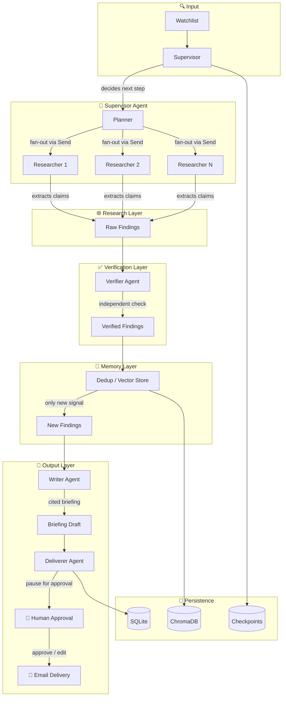

# 🛰️ Radar — Autonomous Market Intelligence Agent

> An autonomous agent that keeps you informed about fast-moving topics — without being told what to look for.

Radar plans its own research, searches the web, reads sources, verifies what it finds, remembers what it already knew, and produces a cited briefing of only what is genuinely new. After your approval, it delivers the briefing by email.

---

## 🏗️ Architecture



### Tech Stack

| Layer | Technology | Purpose |
|-------|-----------|---------|
| **LLM** | Ollama (local) / Groq (free API) | Planning, extraction, verification, writing |
| **Search** | DuckDuckGo (free) / Tavily (optional) | Web search — no API key required |
| **Reading** | Trafilatura + BeautifulSoup | Extract readable content from web pages |
| **Memory** | ChromaDB (vector store) | Semantic dedup — only report new findings |
| **State** | SQLite + LangGraph Checkpointer | Persistent state, crash resume |
| **Framework** | LangGraph | Multi-agent orchestration with subgraphs |
| **Backend** | FastAPI | REST API + WebSocket-ready |
| **Frontend** | React + Vite + TypeScript | Real-time dashboard |
| **Tracing** | LangSmith (optional) | Pipeline observability |

---

## 📁 Project Structure

```text
backend/
├── main.py                 CLI entry point
├── api.py                  FastAPI application + all endpoints
├── config.py               Environment configuration
├── scheduler.py            Daily cron scheduler (calls API)
├── notes.md                Engineering failure log
├── requirements.txt        Python dependencies
├── graph/
│   ├── state.py            AgentState TypedDict (shared state schema)
│   ├── supervisor.py       Supervisor agent (orchestrates subgraphs)
│   └── subgraphs.py        Each agent as a LangGraph subgraph
├── agents/
│   ├── planner.py          Decomposes topics into research questions
│   ├── researcher.py       Web search + claim extraction
│   ├── verifier.py         Independent fact-checking (anti-hallucination)
│   ├── writer.py           Cited briefing composition
│   └── deliverer.py        Email delivery + approval gate
├── tools/
│   ├── db.py               SQLite data access layer
│   ├── search.py           DuckDuckGo + Tavily search wrapper
│   ├── reader.py           Web page content extractor
│   ├── vector_store.py     ChromaDB dedup store
│   └── run_events.py       Live event logging + cost tracking
├── eval/
│   ├── eval_set.json       Ground-truth evaluation dataset
│   └── evaluator.py        Offline accuracy/precision evaluation
└── db/
    ├── schema.sql          Database DDL
    ├── radar.sqlite        Application data
    ├── checkpoints.sqlite  LangGraph crash-recovery checkpoints
    └── chroma/             ChromaDB persistent vector store
frontend/
├── src/
│   ├── App.tsx             Root component
│   ├── api/radarApi.ts     Backend API client
│   └── components/         Dashboard views, sidebar, modals
└── server.ts               Dev server
setup.sh                    One-command setup script
```

---

## 🚀 Quick Start

### Prerequisites
- **Python 3.13+**
- **Node.js 18+**
- **Ollama** (for local LLM) — install from [ollama.ai](https://ollama.ai)

### 1. Clone & Setup

```bash
git clone https://github.com/Musmannazir/Radar_Autonomous-Market-Intelligence-Agent
cd Radar_Autonomous-Market-Intelligence-Agent
bash setup.sh
```

Or manually:

```bash
# Backend
cd backend
python -m venv venv
venv/Scripts/pip install -r requirements.txt
cp .env.example .env    # Edit with your values
cd ..

# Frontend
cd frontend
npm install
```

### 2. Configure Environment

Edit `backend/.env` — the only required value is **nothing** for basic DuckDuckGo search. Add keys for optional services:

```env
# Works out of the box — DuckDuckGo needs no key
VERIFIER_PROVIDER=ollama    # or "groq" for faster verification
GROQ_API_KEY=               # only if using Groq
TAVILY_API_KEY=             # optional, better search content
GMAIL_ADDRESS=              # for email delivery
GMAIL_APP_PASSWORD=         # Gmail App Password
```

### 3. Run

```bash
# Terminal 1 — Backend
cd backend
venv/Scripts/uvicorn api:app --reload --port 8000

# Terminal 2 — Frontend
cd frontend
npm run dev

# Terminal 3 — (Optional) Scheduler
cd backend
venv/Scripts/python scheduler.py
```

Open **http://localhost:3000** — add a watchlist item and start a run!

---

## 🔌 API Endpoints

| Method | Path | Description |
|--------|------|-------------|
| `GET` | `/health` | Health check |
| `GET` | `/dashboard/metrics` | Agent fleet, counts, live run state |
| `GET` | `/dashboard/evaluations` | Factual accuracy + signal precision eval |
| `GET` | `/dashboard/settings` | System configuration |
| `POST` | `/watchlists` | Create watchlist item |
| `GET` | `/watchlists` | List all watchlist items |
| `PATCH` | `/watchlists/{id}` | Toggle active flag |
| `DELETE` | `/watchlists/{id}` | Delete watchlist item |
| `POST` | `/watchlists/{id}/run` | Start run for a watchlist item |
| `POST` | `/runs` | Start ad-hoc run |
| `GET` | `/runs` | List recent runs |
| `GET` | `/runs/{run_id}` | Get live run status |
| `GET` | `/approvals/pending` | Briefings awaiting approval |
| `POST` | `/approvals/{run_id}` | Approve / edit / reject briefing |
| `GET` | `/briefings` | List recent briefings |

---

<<<<<<< HEAD
- If the frontend shows no live data, confirm the backend is running on port `8000`.
- If research steps fail early, check that Ollama is running and reachable.
- If verification fails with a Groq error, switch `VERIFIER_PROVIDER` back to `ollama` or provide a valid `GROQ_API_KEY`.

=======
## 🧪 How the Pipeline Works

```
1. WATCHLIST  → User adds a topic (e.g., "AI startup funding")
2. PLANNER    → LLM decomposes into research questions:
                 ["Recent AI startup Series A rounds 2024",
                  "Top AI companies raising funding",
                  "AI market valuation trends"]
3. RESEARCHERS → Parallel web search + claim extraction (one per question)
4. VERIFIER    → Independent fact-checking against source pages
                 - Confirmed claims pass through
                 - Unsupported claims are rejected
                 - Low-confidence items are flagged
5. DEDUP       → ChromaDB semantic similarity check
                 - Already-reported claims filtered out
                 - Only genuinely new signal survives
6. WRITER      → Composed cited briefing with "why it matters"
7. DELIVERER   → Pauses for human approval (edit/reject/approve)
                 → Emails the briefing via Gmail SMTP
```

### Anti-Hallucination Layer

- Every claim carries an exact source URL (attached programmatically, not by the LLM)
- The **Verifier** independently re-reads each source page and judges each claim
- Claims that fail verification are **rejected**, not flagged
- Low-confidence claims (below 0.5) are excluded regardless of verdict
- The **Dedup** layer prevents the same news from appearing in future briefings

### Crash Recovery

- LangGraph checkpoints every node transition to `db/checkpoints.sqlite`
- If the server crashes mid-run, restart and the run resumes from the last successful step
- The API tracks run state (`running` → `awaiting_approval` → `approved/rejected`)

### Cost Control

- `MAX_LLM_CALLS_PER_RUN` caps total LLM invocations (default: 25)
- `MAX_SEARCH_CALLS_PER_RUN` caps web search calls (default: 20)
- Per-run cost tracking via `tools/run_events.py`
- Exponential backoff on search API failures

---

## 📊 Evaluation

Radar includes an offline evaluation harness:

- **`backend/eval/eval_set.json`** — ground-truth claims with expected verdicts
- **`backend/eval/evaluator.py`** — computes:
  - **Factual Accuracy** — % of claims correctly verified
  - **New-Signal Precision** — % of findings that are genuinely novel
  - **False Positive Rate** — % of claims that should have been rejected
- **`GET /dashboard/evaluations`** — live evaluation report

---

## 🔧 Troubleshooting

| Problem | Solution |
|---------|----------|
| Frontend shows no data | Confirm backend is running on port 8000 |
| Research fails early | Check Ollama is running: `ollama serve` |
| Verification errors | Switch to `VERIFIER_PROVIDER=ollama` or check Groq key |
| Email delivery fails | Verify `GMAIL_ADDRESS` and `GMAIL_APP_PASSWORD` in `.env` |
| Slow pipeline | DuckDuckGo is used by default (no key needed). Add Tavily key for faster extraction |
| Scheduler not working | Ensure the API server is running first: `uvicorn api:app --port 8000` |

---

## 📝 Engineering Log

See [`backend/notes.md`](backend/notes.md) for the engineering failure log — documenting the hardest bugs encountered and how they were fixed. Key failures include:

1. **Hallucinated source URLs** — LLM inventing URLs → fixed by attaching real URLs programmatically
2. **ChromaDB distance metric mismatch** — wrong similarity scores → fixed with cosine space
3. **Rate-limit false-passes** — silent error handling → introduced fail-closed `error` verdict

---

## 📄 License

This project is for educational purposes as a capstone project.
>>>>>>> 8d1433a (Fullfil requirments)
